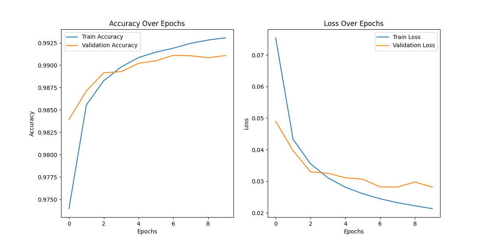
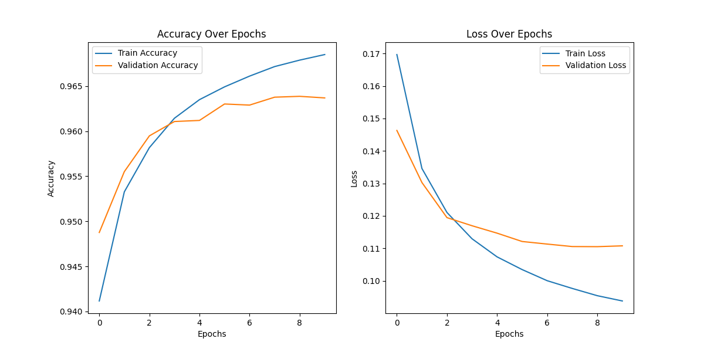
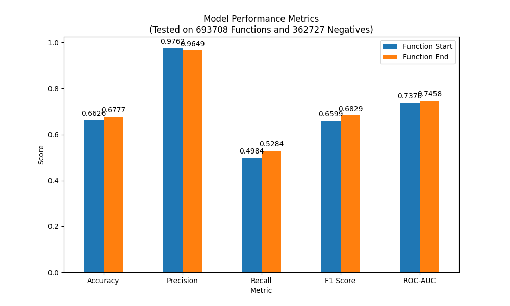
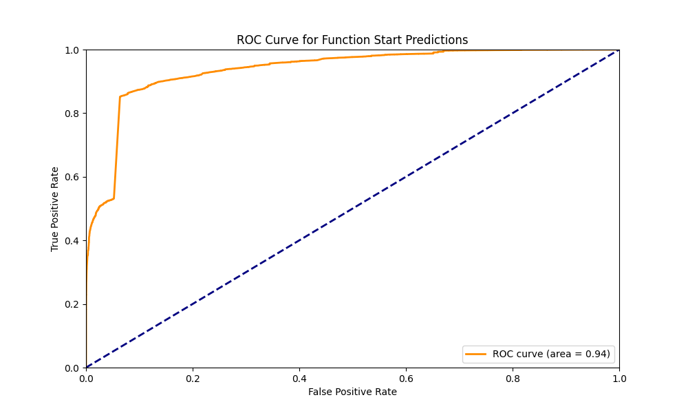
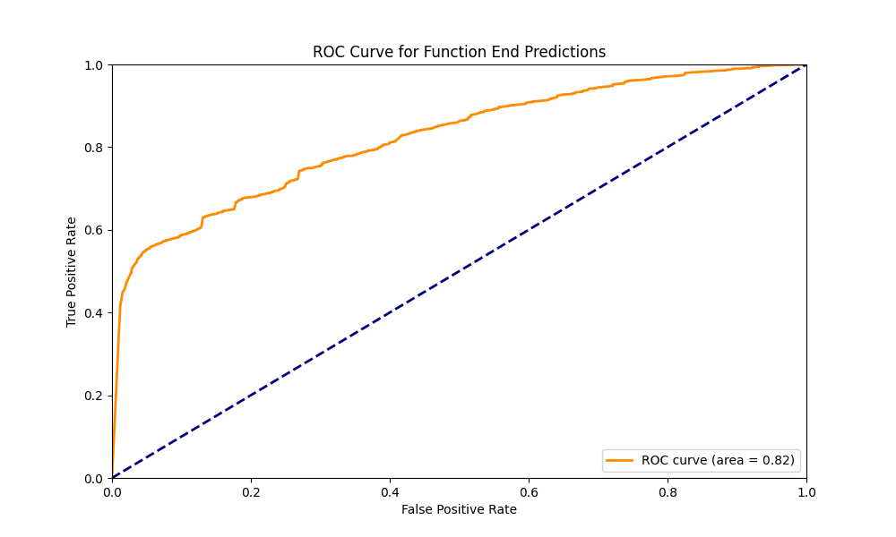
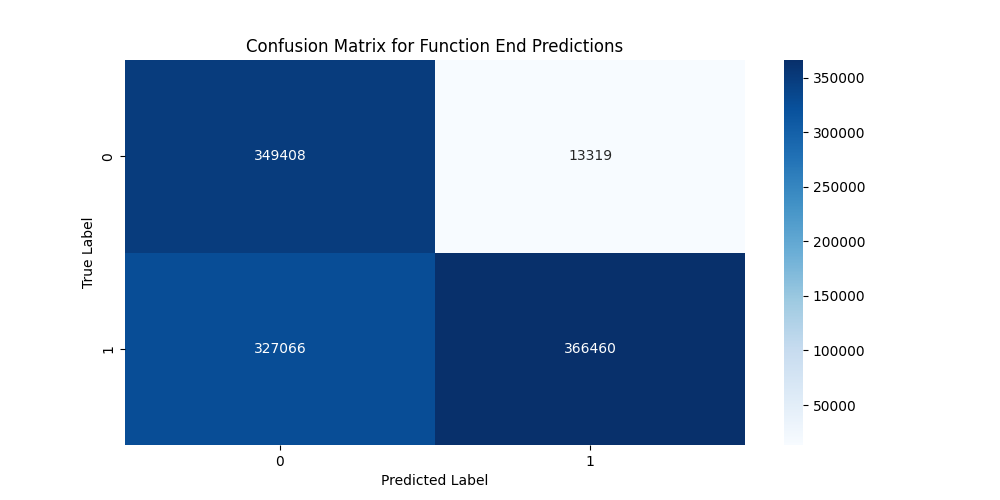

# Pythia
An RNN model aimed at detecting [prologues](https://en.wikipedia.org/wiki/Function_prologue_and_epilogue) and [epilogues](https://en.wikipedia.org/wiki/Function_prologue_and_epilogue) in compiled ELF binaries.

Mnemonics and instruction registers are extracted from prologues and epilogues from executables using IDA (or similar), which is then used to train the model. Some information from the instructions are purposefully ommited during extraction as to not pollute the training set.

Take for example;
```asm
lea     rdi, unk_E290
lea     rax, unk_E290
cmp     rax, rdi
jz      short locret_5FD8
```

There is a lot of information in this extraction, but almost none of it is relevant to the model. Specifically, `unk_E290`, `unk_E290`, and `locret_5FD8` would just pollute our tokenizer and training set. Our extraction (and therefore in training), this would be translated to:

```asm
lea     rdi
lea     rax
cmp     rax, rdi
jz
```

As it is the only relevant information.

## Extracting model training data
Put all training executables in `samples` and run `python python/extract.py`. This extracts the known good prologues and epilogues from the training executables using the great [ida-headless](https://pypi.org/project/headless-ida/) library. Prologues are naively assumed to be the first 5 instructions of the executable, and epilogues are naively assumed to be the last 5 instructions of the executable. The training data is then written to `samples/{executable_name}.json`.

Extraction can take a long time, due to the fact that IDA needs to process each executable, then run our headless script to extract all function prologues and epilogues disassembly.

## Training the model
Run `python python/train.py` to train the model. This trains the model on the training data extracted in the previous step. The model is the nsaved to `models/model_[start/end].keras`, which then can be converted to an ONNX model using `python python/convert.py`. The ONNX model is saved to `models/model_[start/end].onnx`.

I would recommend using the executables located in `/bin/` or `/usr/bin/` for extraction and training, as it is commonly a very large dataset.

## Testing the model
Run `python python/accuracy.py` to get metics on the accuracy of the model.

## Running the example
Simply run `cargo run --release [executable file]` to run the example. It will print out all functions detected in the executable using the models.

## Reflection
This project was completed in a weekend, it was my first time doing any sort of machine learning and I learned a lot. There are some obvious caveats to this project that I will discuss.

1. The training results are somewhat hyper-inflated due to the fact that on my distro (maybe Linux in general?) many functions start with the `endbr64` mnemonic, which makes identifying function prologues MUCH easier. This explains why the model is so accurate on function starts, but not necessarily on function ends. I would be interested in seeing how training on Windows executables would perform. (TODO)
   
2. In the future I would certainly feel more comfortable choosing the architecture of the model. I had a few iterations of this project, first Logistic Regression on raw bytes of the prologues and epilogues, then an RNN on just the mnemonics of the prologues and epilogues, then a transformer on the current training data, then finally an RNN on the current training data. It took a lot of experimentation to get the best architecture for this project, and knowing what I know now, I feel like an RNN is the obvious choice, as the sequence data is small and the model is relatively simple.

## Training Results



## Performance Results




